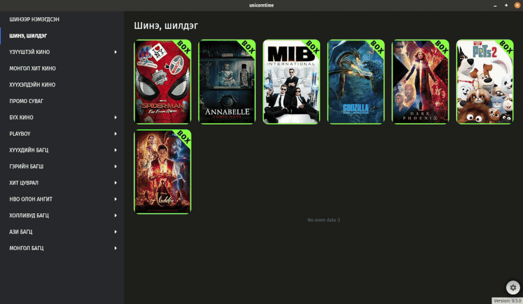

# unicorntime

## Download

Mocked API Version: [Release](https://github.com/kono0514/unicorntime/releases/tag/mocked)  
Server API Version: [Latest](https://github.com/kono0514/unicorntime/releases/latest)



## Notes

You can switch between mocked API and server API.

To switch, specify `server` or `mock` in .env file.  

You'll need OAuth 1.0 consumerKey, consumerSecret, token and secret to communicate with the live server API.
Click on the settings button in bottom right corner to specify them as a Base64 encoded string.

Example:
```
const obj = {
  consumerKey: '',
  consumerSecret: '',
  token: '',
  secret: ''
};
const base64string = btoa(JSON.stringify(obj));
```

## Requirements

[MPV](https://mpv.io/) player is required. Download and add it to your PATH.

```
mpv --version
```

## Project setup

```
yarn install
```

### Compiles and hot-reloads for development

```
yarn serve
```

### Compiles and minifies for production

```
yarn build
```

### Build and publish new version to Github

```
docker run --rm -ti  --env-file <(env | grep -iE 'DEBUG|NODE_|ELECTRON_|YARN_|NPM_|CI|CIRCLE|TRAVIS_TAG|TRAVIS|TRAVIS_REPO_|TRAVIS_BUILD_|TRAVIS_BRANCH|TRAVIS_PULL_REQUEST_|APPVEYOR_|CSC_|GH_|GITHUB_|BT_|AWS_|STRIP|BUILD_')  --env ELECTRON_CACHE="/root/.cache/electron"  --env ELECTRON_BUILDER_CACHE="/root/.cache/electron-builder"  -v ${PWD}:/project  -v ${PWD##*/}-node-modules:/project/node_modules  -v ~/.cache/electron:/root/.cache/electron  -v ~/.cache/electron-builder:/root/.cache/electron-builder  electronuserland/builder:wine
export GH_TOKEN=GITHUB_ACCESS_TOKEN
yarn
yarn electron:build -p always --linux AppImage --win nsis --x64
```

### Lints and fixes files

```
yarn lint
```